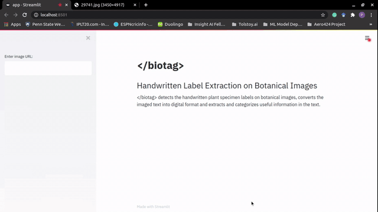

# \<biotag\>
Handwritten Labels Extraction and Tagging in Botanical Images

***Parts of Scripts in this repository has been redacted due to copyright reasons***

## Motivation

Museums are manually digitizing millions of imaged documents of Herbarium sheets, which might take decades to complete at the current pace of manual transcription. This repository proposes a model using AI tools to automate the transcription process, to cut down the time significantly and facilitate faster and easier access to resources.



## Installation

Clone the github repository and set biotag as the working directory.
```
git clone https://github.com/Pratheebhak/biotag.git   
cd ./biotag
```


### Requisites
This repository has the following dependencies:
* [Anaconda](https://docs.anaconda.com/anaconda/install/)
* Streamlit
* Google Cloud API Credentials (for OCR)

### Setup

Create a conda virtual environment and install the dependencies
```
conda create-n biotag python=3   
conda activate biotag   
pip install -r requirements.txt   
```

### Run
```
streamlit run app.py
```

### Docker (Optional)
To containerize the Streamlit app,
* Install Docker [Desktop](https://www.docker.com/products/docker-desktop) or [Engine](https://docs.docker.com/engine/)
* Run the following commands for docker build and run
```
docker build -t biotag-streamlit:v1 -f DockerFile .
docker run -p 8501:8501 biotag-streamlit:v1
```


